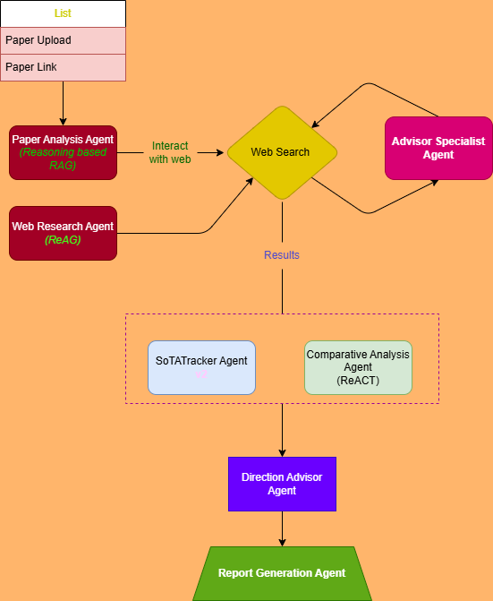

# 🧠 Research Copilot

AI-Powered Deep Research Assistant using LLMs & Multi-Agent Architecture.

- Live Demo: https://research-copilot-tau.vercel.app/
- GitHub Repository: https://github.com/Viraj465/Research-Copilot.git

# 🚀 Overview

1. Research Copilot is an AI-powered research assistant designed to help users deeply analyze research papers, articles, and technical documents using Large Language Models (LLMs) and a multi-agent AI system.

2. Instead of simple summarization, the system decomposes research tasks into smaller subtasks handled by specialized agents, enabling accurate insights, contextual understanding, and structured outputs.

3. This project demonstrates applied GenAI, backend engineering, and production deployment skills.

# 🎯 Key Features

📄 *Upload or input research content

🤖 Multi-agent AI architecture for deep analysis

🧠 Context-aware summarization & reasoning

🔍 Insight extraction and structured responses

🌐 Full-stack web application

🚀 Deployed on production infrastructure

# 📂 Project Structure

Research-Copilot/
│
├── backend/            # API & AI logic
├── frontend/           # UI application
├── Supabase/           # Database configuration
├── llm.py              # Core LLM & agent logic
├── Dockerfile          # Container configuration
├── requirements.txt    # Python dependencies
└── README.md

# ⚙️ How to use?

1. Choose an LLM provider from the options provided.
2. Input **GOOGLE_API_KEY**, **OPENAI_API_KEY**, and **GROQ_API_KEY** *(Optional use any one or all(recommended))*.
3. Use **TAVILY_API_KEY** (Compulsory, for web search).

# 📈 Use Cases

Academic research analysis

Literature reviews

Technical documentation understanding

AI-powered study assistant

Knowledge extraction from long documents

# 🧠 Why This Project Matters

- This project demonstrates:

- Real-world GenAI system design

- Multi-agent reasoning architecture

- Backend + frontend integration

- Production deployment mindset

- Clear separation of concerns

**Perfect for SDE, Applied AI Engineer, or ML Engineer roles.**

# ⭐ If you like this project

Give it a ⭐ on GitHub — it helps visibility!